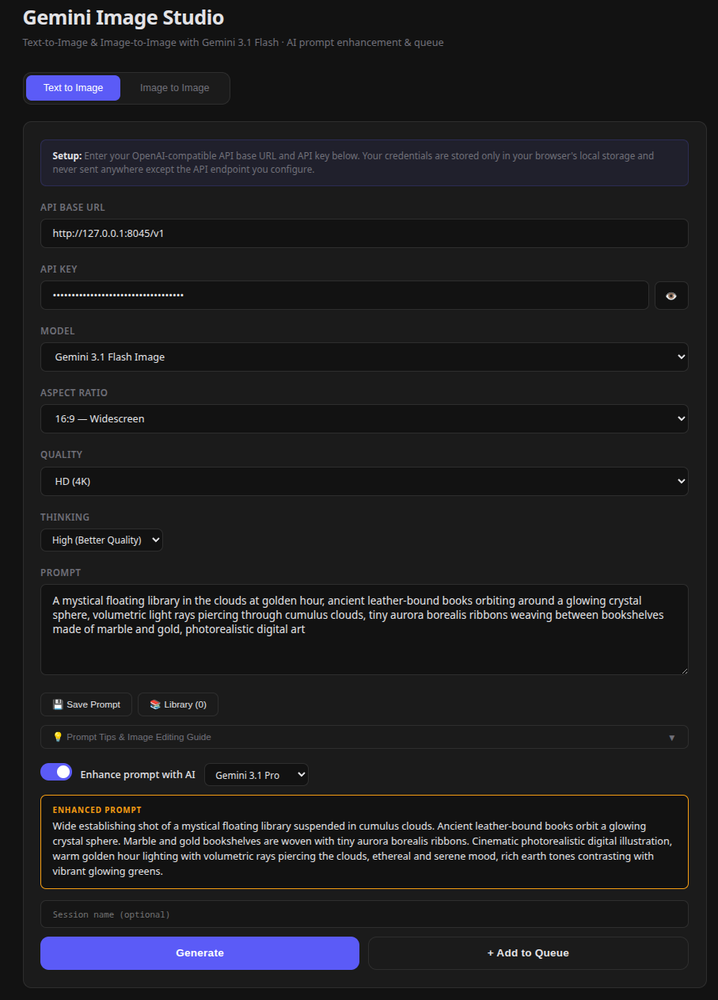
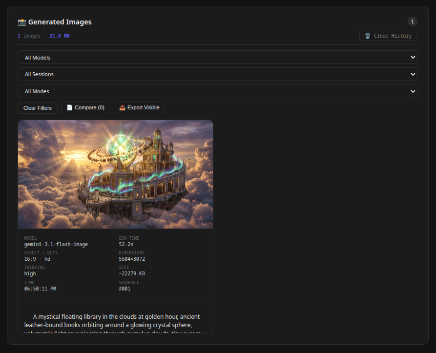
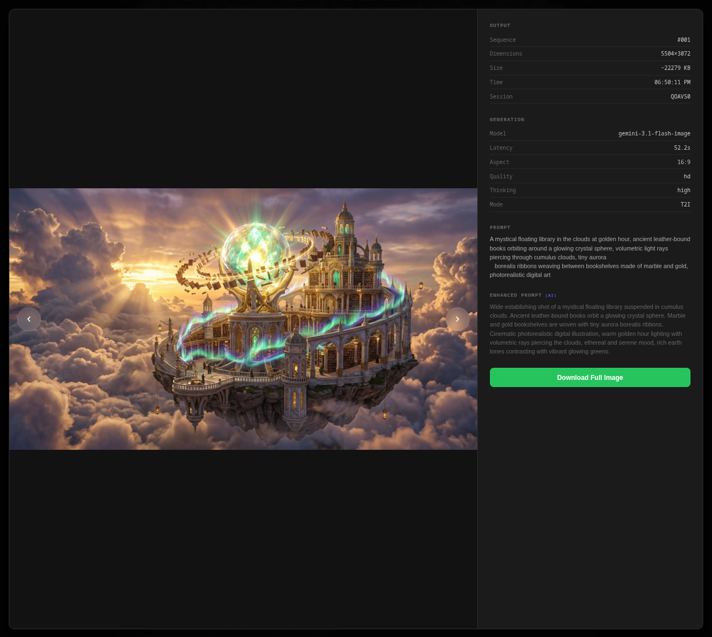

# Gemini Image Studio

A zero-dependency, browser-based AI image generation studio powered by Gemini. Text-to-image, image-to-image editing, AI prompt enhancement, batch queue, gallery with filters, and more — all running as a static web app.

### Text-to-Image & Prompt Enhancement


### Gallery with Filters & Metadata


### Lightbox with Metadata Sidebar


## Features

- **Text-to-Image** — Generate images from text prompts via Gemini 3.1 Flash Image
- **Image-to-Image** — Upload 1–2 reference images for style transfer, inpainting, editing, and combination
- **AI Prompt Enhancement** — Automatically enrich prompts using a separate Gemini model (Flash, Pro) with tier-aware system prompts
- **Batch Queue** — Queue multiple generation jobs and run them sequentially
- **Gallery with Filters** — Filter by model, session, and mode; bulk export visible results
- **Image Comparison** — Select multiple images for side-by-side comparison
- **Lightbox** — Full-screen image viewer with keyboard navigation and metadata sidebar
- **Prompt Library** — Save, tag, search, and reuse prompts
- **Debug Console** — Inspect API requests/responses, timing, and errors in real time
- **Persistent History** — All generated images stored in IndexedDB with metadata
- **Auto-Download** — Images automatically saved to `downloads/` on generation

## Quick Start

```bash
git clone https://github.com/<your-username>/gemini-image-studio.git
cd gemini-image-studio
npx serve . -p 8080
```

Open `http://localhost:8080` in your browser.

## Prerequisites

You need an OpenAI-compatible API proxy that forwards requests to the Gemini API. The app calls standard `/v1/images/generations` and `/v1/chat/completions` endpoints.

Examples:
- [Antigravity Manager](https://github.com/lbjlaq/Antigravity-Manager) (default: `http://127.0.0.1:8045/v1`)
- Any OpenAI-compatible gateway that routes to Gemini

## Configuration

All settings are saved in your browser's localStorage — credentials never leave your machine except to the API endpoint you configure.

| Setting | Description |
|---------|-------------|
| **API Base URL** | OpenAI-compatible endpoint (default: `http://127.0.0.1:8045/v1`) |
| **API Key** | Your API key for the configured endpoint |
| **Model** | Image generation model (default: `gemini-3.1-flash-image`) |
| **Enhance Model** | Model used for prompt enhancement (Gemini 3 Flash, 2.5 Flash, 2.0 Flash, 3.1 Pro) |

## Project Structure

```
.
├── index.html              # Main HTML shell — UI layout, controls, overlays
├── style.css               # All styles — dark theme, responsive layout, animations
├── src/
│   ├── main.js             # App initialization, settings, dropzones, event wiring
│   ├── api.js              # API calls — T2I, I2I, prompt enhancement with tier-aware prompts
│   ├── state.js            # Shared application state, storage keys, session ID
│   ├── gallery.js          # Gallery rendering, history (IndexedDB), filters, lightbox, compare
│   ├── queue.js            # Batch queue — add jobs, run sequentially, progress tracking
│   ├── prompt-library.js   # Save/load/search/tag prompts in localStorage
│   ├── history.js          # IndexedDB persistence layer for generated images
│   ├── debug.js            # Debug console — log groups, copy JSON, collapse/clear
│   └── utils.js            # DOM helpers ($, $$), toast notifications, status bar
├── package.json            # Metadata and serve script (no dependencies)
└── downloads/              # Auto-downloaded generated images (gitignored)
```

## Supported Settings

### Aspect Ratios
1:1 (Square), 16:9 (Widescreen), 9:16 (Mobile), 4:3 (Traditional), 3:4 (Portrait), 3:2 (DSLR), 2:3 (Portrait Photo), 21:9 (Ultra-wide), 5:4 (Large Format), 4:5 (Social Media)

### Quality Tiers
- **Standard (1K)** — Balanced quality and speed
- **Medium (2K)** — Higher detail for print and web
- **HD (4K)** — Maximum quality, production-ready

### Thinking Levels
- **Minimal** — Fast generation, good for simple prompts
- **High** — Model reasons through the prompt before rendering, better quality and adherence

## Keyboard Shortcuts

| Shortcut | Action |
|----------|--------|
| `Ctrl+Shift+Q` | Add current prompt to queue |
| `←` / `→` | Navigate images in lightbox |
| `Escape` | Close lightbox / overlays |

## Tech Stack

- **Vanilla JavaScript** with ES modules — no framework, no build step
- **IndexedDB** for persistent image history
- **localStorage** for settings and prompt library
- **Web Audio API** for notification sounds
- Works in any modern browser — just serve the static files

## License

[MIT](LICENSE)
